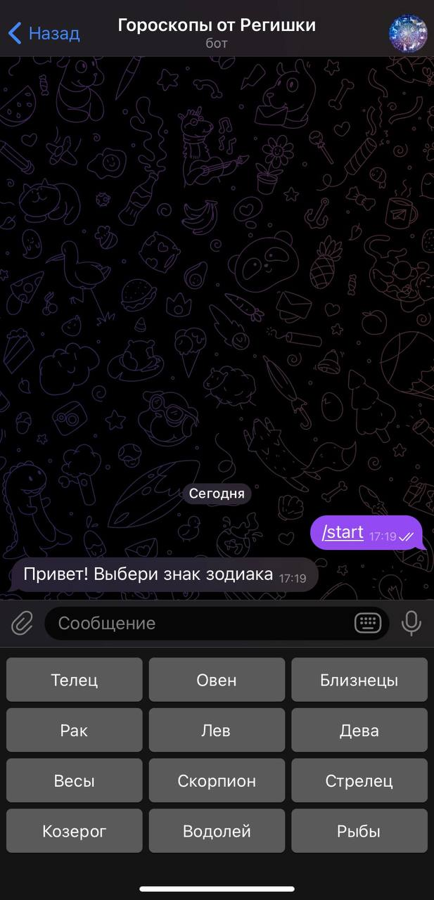
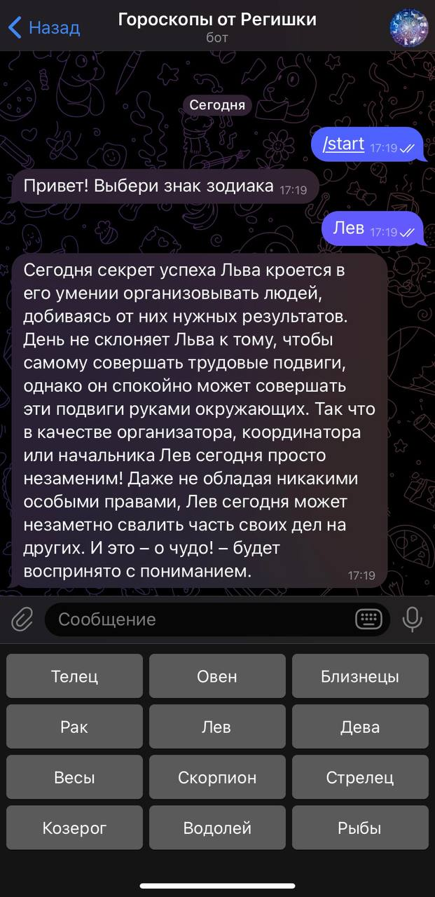
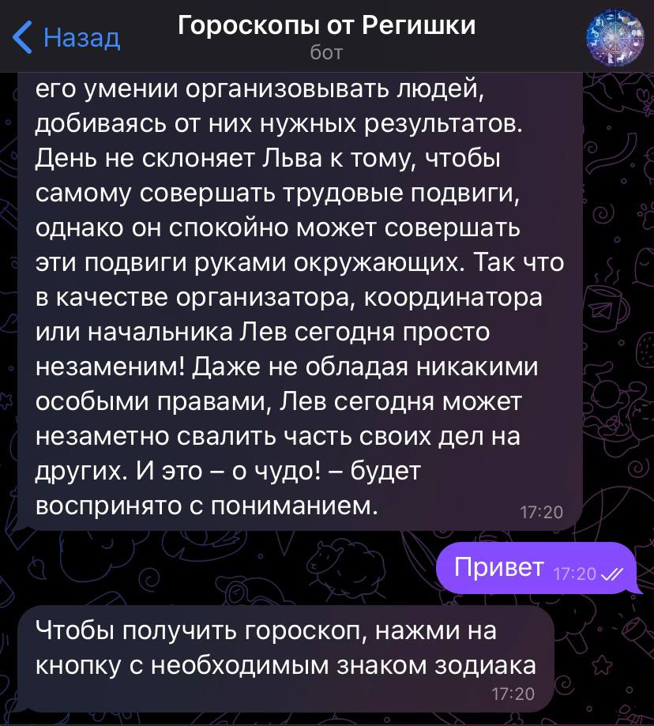

# Horoscope telegram bot
## Описание 
Телеграм бот, отправляет по запросу пользователя гороскоп на текущий день для выбранного знака зодиака 
## Запуск
### Docker
1. Скачать image проекта\
`docker pull galievaregina/telegram_bot`
2. Запустить Docker container\
`docker run galievaregina/telegram_bot`

## Тесты

- main 

- develop 
## Примеры использования
1. После нажатия кнопки "Начать", телеграм бот отправляет сообщение "Привет! Выбери знак зодиака", и на клавиатуре появляются кнопки с двенадцатью знаками зодиака.

2. Чтобы получить гороскоп, нужно нажать на кнопку с необходимым знаком зодиака 

3. Если отправить любое соообщение, кроме : "Овен", "Телец", "Близнецы", "Рак", "Лев", "Дева", "Весы", "Скорпион","Стрелец", "Козерог", "Водолей", "Рыбы",то бот предупредит о том,что получить гороскоп можно только нажав на кнопку

